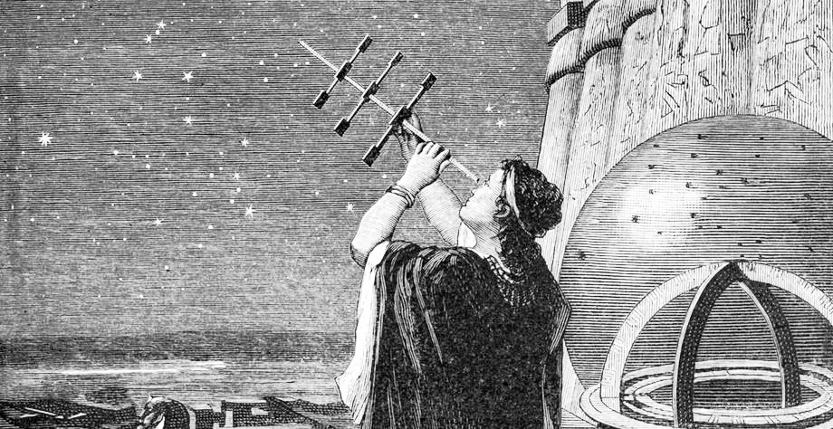

# HYPATIA [](https://github.com/sponsors/patriciogonzalezvivo)

Hypatia is a geo-astronomical library based on the work of  [Jean Meeus](https://en.wikipedia.org/wiki/Jean_Meeus), [Mark Huss](http://mhuss.com/AstroLib), [Bill Gray](https://github.com/Bill-Gray ), [Stuart Lowe](http://mhuss.com/AstroLib), [Brandon Rhodes](https://github.com/brandon-rhodes/pyephem) , [Daniel Warner](https://github.com/dnwrnr/sgp4), [Oliver Montenbruck and Thomas Peleger](https://www.amazon.com/gp/product/3540672214/ref=oh_aui_detailpage_o00_s00?ie=UTF8&psc=1). Was created mostly for educational purposes, but also to use in different personal artistic projects. 

In comparison with other astronomical/geographical libraries created for profesional uses Hypatia have a focus on: 
* reusability and portability
* realtime performance
* simplicity of the interface, than other 

## Hypatia as C++ lib

You can easily add hypatia into your project by adding the `include/` and `src/` folder or by installing hypatia into your system. For the former option you need to:

```bash
sudo apt install cmake swig
mkdir build
cd build
cmake ..
make
sudo make install
```

```cpp
#include <sstream>

#include "hypatia/Body.h"
#include "hypatia/Luna.h"
#include "hypatia/Constellation.h"

void main(int argc, char **argv) {

    obs = Observer(40.781098831465, -73.97715657655);

    sun = Body(SUN);
    moon = Luna(LUNA);
    std::cout << "Moon's phase: " << moon.getPhase() << std::endl

    const = Constellation(moon)
    std::cout << "Moon's transit constelation: " << const.getName() << std::endl

    return 0;
}
```

## Hypatia as Python module

First you need to create the package and install it

```bash
sudo apt install swig
make install
```

**Note**: to install inside anaconda do:
```bash
/anaconda3/bin/./python3.7 setup.py install 
```

Then you can use it as follow:

```python
from hypatia import *

obs = Observer(40.781098831465, -73.97715657655)

sun = Body(SUN)
sun.compute(obs)

moon = Luna(LUNA)
moon.compute(obs)
print("Moon's phase: ", const.getPhase())

const = Constellation(moon)
print("Moon's transit constelation: ", const.getName())
```

# License

Hypatia have a [non-commercial open source license](LICENSE.md).. If you want to use it for a commercial project, you have 30 days trial time. After that please get in touch to patriciogonzalezvivo@gmail.com to purchase a license.
